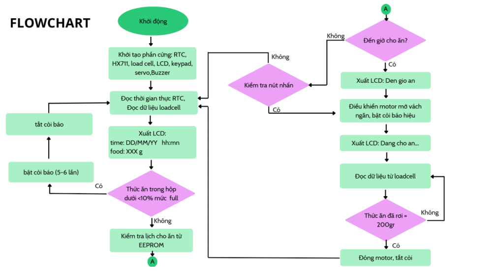
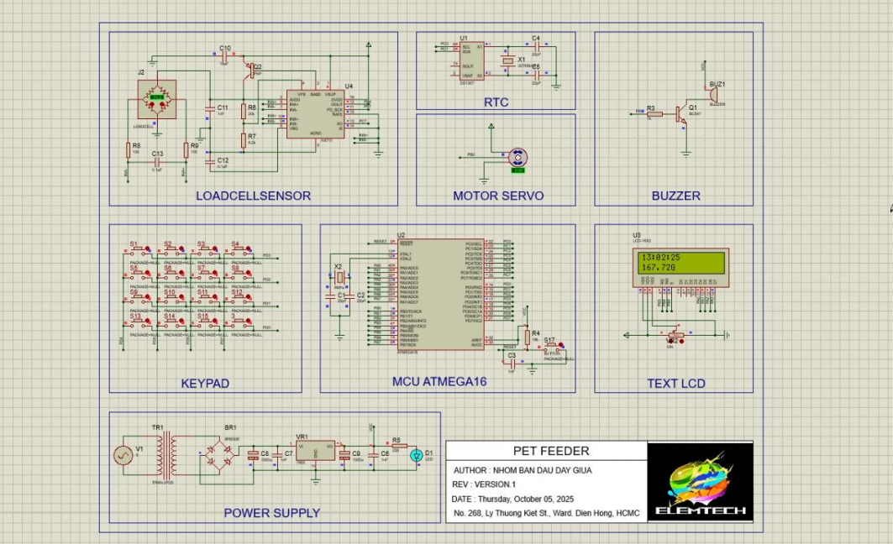
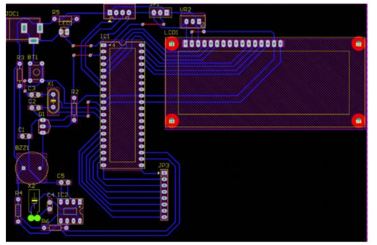
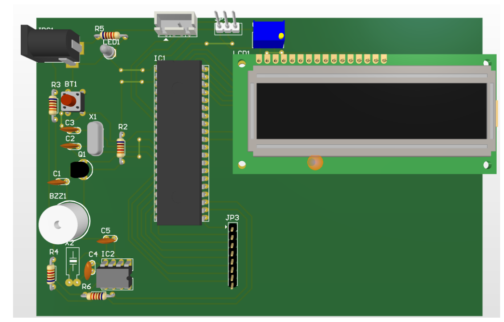
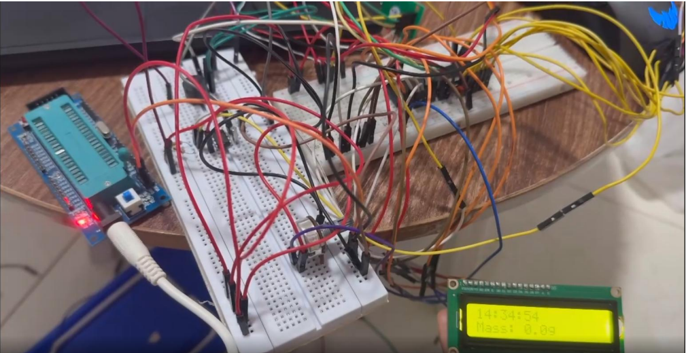
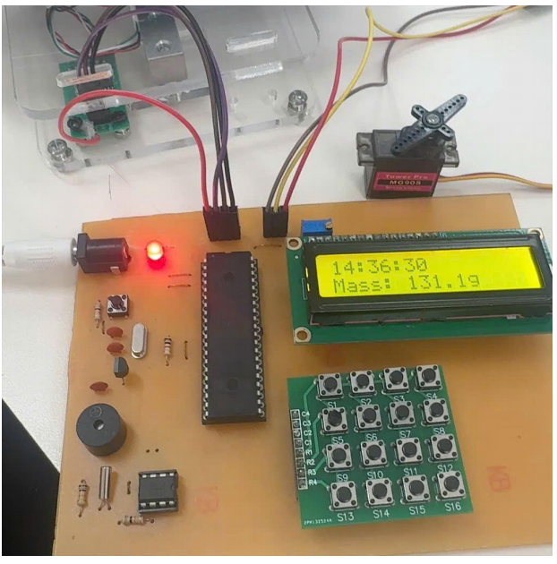
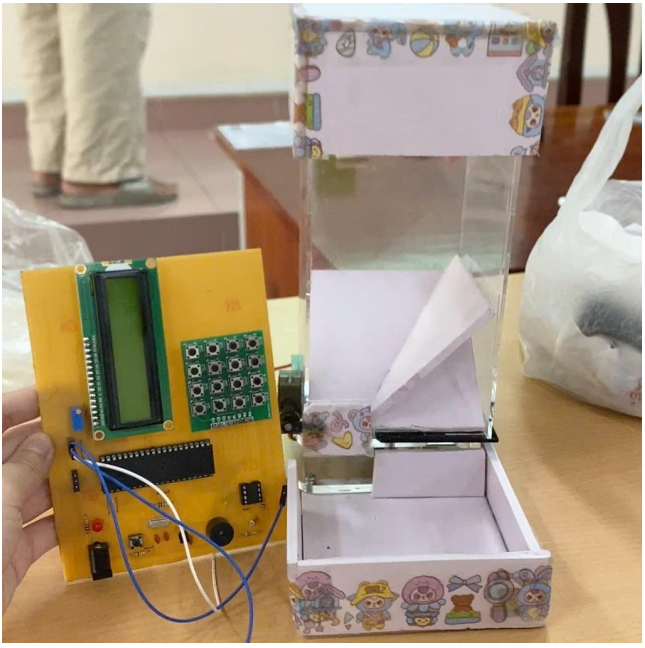

# smart-pet-feeder-system
A bare-metal ATmega16 automatic pet feeder project with loadcell and RTC
# Smart Pet Feeder System 🐾

[cite_start]A fully automated, soft real-time embedded system designed to dispense pet food based on customizable schedules and precise weight measurements. [cite_start]Built on the AVR architecture, this project demonstrates hardware-software co-design, non-blocking firmware execution, and custom PCB routing.

---

## 🚀 System Architecture & Hardware Specifications

[cite_start]The system is designed around a central microcontroller that handles real-time clock inputs, structural weight sensor filtering, and PWM actuation:

* [cite_start]**Microcontroller:** ATmega16A (8-bit AVR running at an internal/external clock).
* [cite_start]**Timekeeping module:** RTC DS1307 utilizing the I2C communication protocol for reliable feeding schedules.
* [cite_start]**Weight Measurement:** 5kg Load cell interfaced with a high-precision HX711 24-bit ADC module.
* [cite_start]**Actuator mechanism:** SG90 Micro Servo motor driven by dedicated PWM signals to control the dispenser gate.
* [cite_start]**User Interface:** A 16x2 Character LCD paired with a 4x4 Matrix Keypad for localized time and portion configuration.
* [cite_start]**Power Management:** System operates on a stable 5V DC adapter with isolated paths to mitigate servo back-EMF noise.

---

## 📊 System Design Details

### Hardware Block Diagram
[cite_start]Below is the structural layout illustrating how the peripheral units interact with the main MCU core:

### Core Firmware Features
* [cite_start]**Non-Blocking Execution:** Designed with a maximum loop latency under 200ms to maintain strict event responsiveness.
* [cite_start]**Signal Smoothing (DSP):** Features a software-level moving average algorithm for the HX711 ADC to eliminate mechanical vibrations, keeping weight errors within $\pm5g$.
* [cite_start]**Persistant Storage:** Feeding times and custom parameters are dynamically saved onto the onboard EEPROM memory.

---

## 📸 Project Gallery & Results

### Circuit Simulation & PCB Design
[cite_start]The system was successfully simulated and modeled before physical fabrication. [cite_start]The PCB layout consists of a optimized single-layer routing designed for seamless manual etching.

| Proteus Simulation | Altium PCB Layout | 3D Board Visualization |
| :---: | :---: | :---: |
|  |  |  |

### Physical Prototype
[cite_start]The final system achieved a top 3 ranking in excellence during class presentation, demonstrating highly stable operational feedback.

| Breadboard Testing | Final PCB Assembly | Mechanical Enclosure Model |
| :---: | :---: | :---: |
|  |  |  |

---

## 🛠️ Future Enhancements
* [cite_start]**IoT Upgrade:** Integrating an ESP32/ESP8266 Wi-Fi module for cloud synchronization and remote app-based configurations.
* [cite_start]**Closed-Loop Bowl Monitor:** Installing an infrared or proximity sensor on the feeding tray to prevent over-dispensing when food is left over.
* [cite_start]**Power Redundancy:** Introducing a secondary battery backup line to secure feeding operations during standard blackouts.
